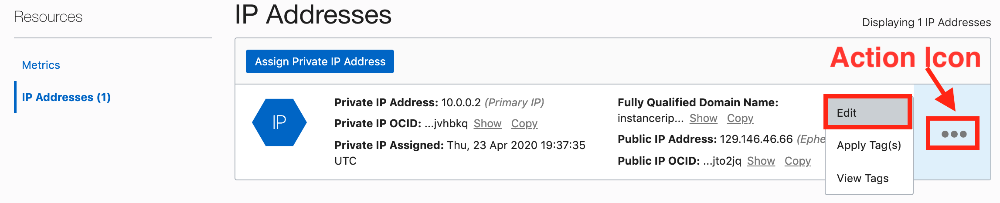

# ReservedIP Practice - Using Reserved Public IP
  
## Table of Contents

[Overview](#overview)

[Pre-Requisites](#pre-requisites)

[Practice 1: Sign in to OCI Console and create reserved public IP](#practice-1-sign-in-to-oci-console-and-create-reserved-public-ip)

[Practice 2: Assign reserved public IP to first compute instance](#practice-2-assign-reserved-public-ip-to-first-compute-instance)

[Practice 3: ssh to compute instance using Reserved Public IP](#practice-3-ssh-to-compute-instance-using-reserved-public-ip)

[Practice 4: Un assign Reserved Public IP](#practice-4-un-assign-reserved-public-ip)

[Practice 5: Create a second compute instance and assign the same Reserved Public IP](#practice-5-create-a-second-compute-instance-and-assign-the-same-reserved-public-ip)

[Practice 6: Delete the resources](#practice-6-delete-the-resources)

## Overview

Oracle Cloud Infrastructure Reserved Public IP service is an internet-scale, high-performance storage platform that offers reliable and cost-efficient data durability. The Reserved Public IP service can store an unlimited amount of unstructured data of any content type, including analytic data and rich content, like images and videos.

With Reserved Public IP, you can safely and securely store or retrieve data directly from the internet or from within the cloud platform. Reserved Public IP offers multiple management interfaces that let you easily manage storage at scale.

Reserved Public IP is a regional service and is not tied to any specific compute instance. You can access data from anywhere inside or outside the context of the Oracle Cloud Infrastructure

The purpose of this lab is to give you an overview of the Reserved Public IP Service and an example scenario to help you understand how the service works.

## Pre-Requisites

- Oracle Cloud Infrastructure account credentials (User, Password, Tenant, and Compartment)  

## Practice-1: Sign in to OCI console and create reserved Public IP

**Note:** OCI UI is being updated thus some screenshots in the instructions might be different than actual UI

### Before You Begin

- We recommend using Chrome, Firefox or Safari as your browser. The new MS Edge browser may not be compatible. Set your browser zoom to 80%

1. Sign in using your tenant name, user name and password.

2. Once signed in, use the main menu to select the Networking option.
   

3. Click on the *Start VCN Wizard* button.

    

4. Fill in the first page of the wizard as follows:

   - **VCN Name:** Set the name to *VCN-ReservedIP*
   - **Compartment:** Has the correct compartment *Demo*
   - Accept the default CIDR blocks
   - Click the *Next* button

   

5. Click the **Create** button.
6. It will take a moment to create all of the resources. When available, click on the *View Virtual Cloud Network* button. Notice how the wizard not only created the VCN, but also the supporting assets:

   - Both a private and public Subnet
   - 2 Route Tables
   - An Internet Gateway
   - 2 Security Lists
   - DHCP Options
   - Service Gateway

7. Using the main menu, select *Networking -> Public IPs* **Networking** screen click **Public IPs**
    

8. Click the **Create Reserved Public IP** button Fill out the dialog box:

   - **NAME:** *MyReservedIP*
   - **CREATE IN COMPARTMENT:** Ensure correct compartment is selected
   - Click the **Create Reserved Public IP** button.

    

## Practice 2: Assign reserved public IP to first compute instance

1. Use the main menu to select **Compute ->Instances**
   

2. Click the *Create Instance* button. Fill out the dialog box:

   - **Name:** *instanceRIP*
   - Click on the *Show Shape, Network and Storage Options* link.
   - **Image Operating System:** Use the default
   - **Availability Domain:** The default should be fine.
   - **Choose Instance Shape:** Use the default
   - Configure Networking
   - - **Virtual Cloud Network Compartment:** Choose the *Demo* compartment
   - - **Virtual Cloud Network:** *VCN-ReservedIP*
   - - **Subnet Compartment:** Choose the *Demo* compartment
   - - **Subnet:** Choose the public Subnet
   - - Click on *Assign a public IP address*
   - **Boot Volume:** Use the default
   - **Add SSH Keys:** Use the SSH key *id_rsa.pub* that you created earlier in this set of labs.

3. Click the **Create** button.

    

4. Wait for the instance to be in the Running state

5. In the instance detail page, under the *Resources* section on the left side of the page, click **Attached VNICs**. You may have to scroll down a bit to see the *Resources* section.

    

6. Click on the VNIC name.
   

7. In VNIC detail page, under the *Resources* section on the left side of the page, click the *IP Addresses* link.

8. Click *Action* icon and then *Edit* from the popup menu.

    

9. In the dialog box under *Public IP Address* try and choose *RESERVED PUBLIC IP*. Notice that you can't do it. That's because the instance already has a *Ephemeral Public IP* address. To assign our reserved IP address, you will first need to select *NO PUBLIC IP*. Notice you will get a small waring in red text at the bottom of the dialog box. Click the **Update** button.

    

10. No use the *Action* menu again to edit the IP address. Now the *RESERVED PUBLIC IP* option is enabled. Select the *RESERVED PUBLIC IP* option and ensure that the *Demo* compartment is selected. Select the *MyReservedIP* address from the list at the bottom of the dialog. Make a note of the IP address. Press the *Update* button to apply your choices.
    

    ***We have successfully assigned a Reserved Public IP address to the compute instance***

## Practice 3: ssh to compute instance using Reserved Public IP

1. Open a terminal window and use the following command to shh into your instance:

    ```bash
    ssh opc@<your-reserved-IP>
    ```

2. Verify *opc@instancerip1* appears on the prompt

    ***We successfully connected to the compute instance using ssh and the reserved public IP. Next we will use the same Public IP and assign it to a different Compute instance***

3. Disconnect your SSH terminal from the compute instance.

## Practice 4: Un assign Reserved Public IP

1. From main menu , click **Compute -> Instances**. Click your instance name

2. In the instance detail page Click **Attached VNICs** and then click on the *instanceRIP* name/link.
    

3. In VNIC detail page, click the *IP Addresses* link on the left side of the screen. Click the *Action* icon and then **Edit**
    

4. In the dialog box under Public IP Address choose **NO PUBLIC IP** (Note the Warning message indicating
Reserved Public IP will be unassigned) . Click the **Update** button
    

    ***Reserved Public IP has now been un-assigned from this compute instance. Next we will create a new compute instance and assign this same Public IP to it.***

## Practice 5: Create a second compute instance and assign the same Reserved Public IP

1. From main menu, Select **Compute -> Instances**
    

2. Click the *Create Instance* button. Fill out the dialog box as done earlier to create second compute instance. Set the **Name** to *instanceRIP2* for clarity's sake. ***SELECT THE DO NOT ASSIGN A PUBLIC IP ADDRESS***

> **NOTE**
>> Just in case you didn't read the second sentence in the step above: Do not select the ***ASSIGN A PUBLIC IP ADDRESS*** option this time. Instead select the ***DO NOT ASSIGN A PUBLIC IP ADDRESS*** option. This will save you the step of having to un-assign it, as you has to do for the first compute instance.

1. Once the instance is in Running state, click Instance name

2. In the instance detail page Click **Attached VNICs**, and then VNIC name

3. In VNIC detail page Click the *IP Addresses* link under the Resources section on the left side of the page. Click the Action icon and then **Edit**

4. In the dialog box under Public IP Address choose *RESERVED PUBLIC IP*, from the drop down list select the Reserved Public IP created earlier. Click the **Update** button.

    

5. Be sure that you disconnected your ssh session from earlier in this lab.

6. Open a terminal and SSH into the public IP address (it is probably still in your terminal's command history if you haven't closed your terminal.

    ```bash
    ssh opc@<your public IP>
    ```

    **NOTE**
    You may get an error like the following:
    
    This is cause by the fact that ssh maintains a file called *known_hosts* to keep track of its prior ssh connections.

    If you get this error, edit the *known_hosts* file in your .ssh directory and remove the line that has the same IP address as your reserved IP address. It should be the last line of the file:
    

7. Verify opc@<COMPUTE_INSTANCE_NAME>
(reserved-ip-instance2 in this case) appears at the prompt

8. Disconnect your SSH session.

## Practice 6: Delete the resources

1. Switch to  OCI console window

2. If your Compute instance is not displayed, From OCI services menu Click *Instances* under *Compute*

3. Locate first compute instance (*instanceRIP*), Click Action icon and then **Terminate**

    

4. Make sure ***PERMANENTLY DELETE THE ATTACHED BOOT VOLUME*** is checked, Click the  *Terminate Instance* button. Wait for instance to fully Terminate

    

5. Repeat steps to delete the second compute instance

6. From the main menu Select **VNetworking -> Virtual Cloud Networks**. A list of all VCNs will appear.

7. Locate your **VCN-ReservedIP** VCN, Click the *Action* icon and then select  *Terminate*.

    

8. You will need to wait for a few moments while OCI checks all of the resources associated with this VCN. When it has completed, click the **Terminate All** button.
    

9. Click **Close** once VCN is deleted
    

10. From OCI services menu Click **Networking**, then **Public IPs**.
    

11. Locate the Reserved Public IP you created. Click Action icon and then *Terminate*
    

12. Press th *Terminate* button when prompted.
    

**NOTE**
You may get error messages about not being able to delete a VCN due to its reliance on a subnet. If that happens, simply look at the subnets within a VNC and delete them first, then you can delete the entire VCN.

***Congratulations! You have successfully completed Using Reserved Public IP address lab. In this lab you created a VCN, Reserved a Public IP, Created 2 compute instances and assigned the same Public IP to both the instance one at a time. This lab demonstrated the option of using one IP to ssh or point to different compute instances***
